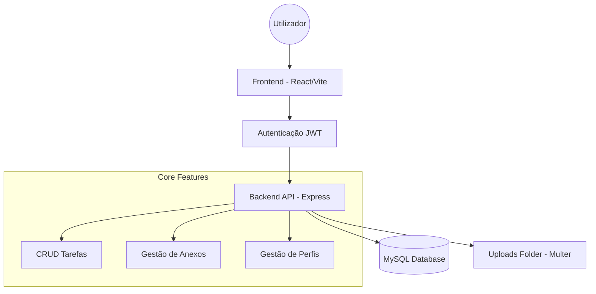

# 🚀 Apresentação do Projeto: TaskFlow

## 📋 Visão Geral
**TaskFlow** é uma plataforma moderna de gestão de tarefas projetada para simplificar a organização pessoal e colaborativa. Com uma interface inspirada em metodologias ágeis (Kanban), o sistema permite o acompanhamento fluido de atividades com foco em segurança e usabilidade.

---

## 🏗️ 1. O Problema vs. A Solução

| **O Desafio** | **Nossa Solução (TaskFlow)** |
| :--- | :--- |
| Desorganização de atividades diárias | **Painel Kanban** visual e intuitivo |
| Dificuldade em centralizar documentos | **Gestão de Anexos** integrada por tarefa |
| Falta de controle de acesso | **Sistema de Perfis** (Admin/Membro) e JWT |
| Interfaces complexas e lentas | **SPA de Alta Performance** com React & Vite |

---

## 🎨 2. Experiência do Utilizador (Frontend)
Desenvolvido com foco em estética e performance:
- **React 19 + Vite**: Velocidade de carregamento instantânea.
- **Styled-Components**: Design system consistente com **Glassmorphism** e cores vibrantes.
- **Responsividade Total**: Experiência fluida em desktop, tablets e telemóveis.
- **Feedback Visual**: Animações de transição e micro-interações para ações do utilizador.

---

## ⚙️ 3. Robustez e Segurança (Backend)
Uma infraestrutura sólida preparada para escalabilidade:
- **Node.js & Express**: API RESTful performante.
- **MySQL**: Base de dados relacional robusta com integridade referencial.
- **Segurança**: 
  - Hash de senhas com **BcryptJS**. 
  - Autenticação via **JSON Web Tokens (JWT)**.
  - Middlewares de proteção de rotas por perfil.

---

## 📊 4. Arquitetura do Sistema

---

## 🗃️ 5. Modelo de Dados
Estrutura otimizada com eliminação em cascata para integridade total:

- **Utilizador**: Gere as suas tarefas e perfil.
- **Tarefa**: Contém status (Pendente, Em Andamento, Concluído) e prazos.
- **Anexo**: Ficheiros vinculados diretamente à regra de negócio da tarefa.

---

## 🌟 6. Diferenciais Estratégicos
1. **Zero CSS Externo**: 100% de estilização via código (Styled-Components).
2. **Sistema de Anexos Real**: Upload, download e exclusão física de ficheiros no servidor.
3. **Controle Admin**: Painel completo para gestão de utilizadores e permissões.
4. **Instalação Simplificada**: Scripts SQL e documentação técnica detalhada.

---

## 🚀 7. Próximos Passos
- [ ] Implementação de **Equipas e Colaboração** em tempo real.
- [ ] Sistema de **Notificações Push** e lembretes por Email.
- [ ] **Modo Escuro (Dark Mode)** dinâmico.
- [ ] Integração com Calendários Externos (Google/Outlook).

---

**Equipa de Desenvolvimento**  
*TaskFlow — Organização que flui.*
