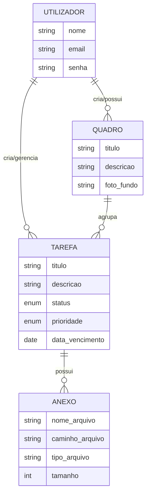

# 🏗️ Modelagem de Dados

**Projeto:** Sistema de Gestão de Tarefas com Anexos e Quadros  
**Versão:** 1.0  
**Data:** 04 de Março de 2026

---

## 🎨 1. Modelo Conceitual (Entidade-Relacionamento)

O modelo conceitual foca no negócio e nas regras de relacionamento, sem detalhes técnicos de banco de dados.

### Diagrama (Mermaid)

### Principais Regras de Negócio:
1.  **Utilizador/Tarefa**: Um utilizador pode ter múltiplas tarefas, mas cada tarefa pertence a um único utilizador.
2.  **Quadro/Tarefa**: Um quadro pode conter diversas tarefas. Uma tarefa pode estar em um quadro ou ser avulsa (opcional).
3.  **Tarefa/Anexo**: Uma tarefa pode ter de zero a muitos anexos. Um anexo é exclusivo de uma tarefa.
4.  **Validação**: A data de vencimento da tarefa deve ser uma data futura.

---

## 📐 2. Modelo Lógico

O modelo lógico define a estrutura de tabelas, chaves primárias (PK), chaves estrangeiras (FK) e tipos de dados universais.

### Estrutura das Tabelas

#### Tabela: `Utilizador`
- `id`: INT (PK)
- `nome`: VARCHAR(100)
- `email`: VARCHAR(100) (UNIQUE)
- `senha`: VARCHAR(200)

#### Tabela: `Quadro`
- `id`: INT (PK)
- `titulo`: VARCHAR(255)
- `descricao`: TEXT
- `foto_fundo`: VARCHAR(500)
- `utilizador_id`: INT (FK -> Utilizador.id)

#### Tabela: `Tarefa`
- `id`: INT (PK)
- `titulo`: VARCHAR(255)
- `descricao`: TEXT
- `status`: ENUM ('Pendente', 'Em Andamento', 'Concluída')
- `prioridade`: ENUM ('Baixa', 'Média', 'Alta', 'Urgente')
- `data_vencimento`: DATE
- `utilizador_id`: INT (FK -> Utilizador.id)
- `quadro_id`: INT (FK -> Quadro.id, NULLABLE)

#### Tabela: `Anexo`
- `id`: INT (PK)
- `nome_arquivo`: VARCHAR(255)
- `caminho_arquivo`: VARCHAR(500)
- `tipo_arquivo`: VARCHAR(100)
- `tamanho_arquivo`: INT
- `tarefa_id`: INT (FK -> Tarefa.id)

---

## ⛓️ 3. Relacionamentos e Integridade
- **CASCADE DELETE**: Ao excluir um **Utilizador**, todos os seus Quadros e Tarefas são removidos.
- **CASCADE DELETE**: Ao excluir uma **Tarefa**, todos os seus Anexos são removidos via chave estrangeira.
- **SET NULL**: Ao excluir um **Quadro**, as tarefas associadas a ele não são excluídas, mas o seu campo `quadro_id` torna-se nulo.

---
> Este documento serve como ponte entre a análise de requisitos e a implementação física do banco de dados SQL.
